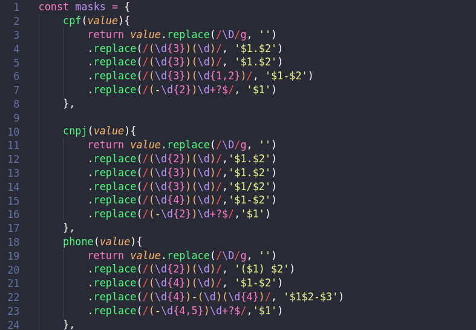

<h1>🚀 Sobre o projeto:</h1>

Esse projeto consiste em criar um input do tipo checkbox que troca os estilos quando ativado. Foi usado o tema de super-heróis em que o superman representa o dia e o batman a noite.

<h2>💻 Tecnologias usadas:</h2>
<ul>
<li>Javascript</li>
<li>HTML</li>
<li>CSS</li>
</ul>

